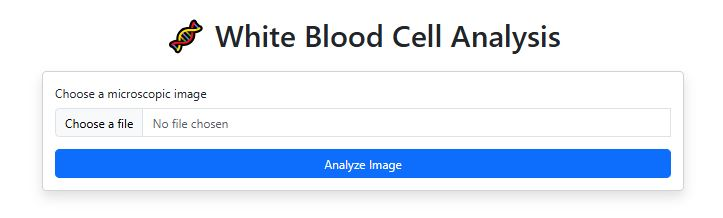
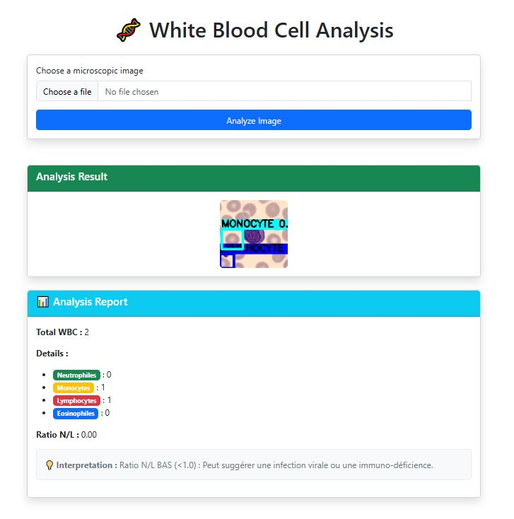

# 🩸 Automated WBC Detection & Classification

## Overview

This project provides an **end-to-end automated system** for detecting and classifying White Blood Cells (WBCs) from microscopic blood smear images. It replaces the tedious manual counting process with AI, delivering a detailed diagnostic report instantly.

- **Detection**: YOLOv8 localizes all WBCs in the image.
- **Classification**: EfficientNet-B0 classifies each WBC into one of four subtypes:
  - Neutrophil
  - Lymphocyte
  - Monocyte
  - Eosinophil
- **Web Application**: A professional web interface (Django + FastAPI) allows clinicians to upload images and receive a structured report (counts, N/L ratio, medical interpretation).

## 🖥️ Web Application - User Interface

The web application allows doctors to upload a microscopic image and instantly obtain a comprehensive analysis report.

### 📤 Step 1: Image Upload

The user selects an image (JPG/PNG format) via the simple interface.

### 📊 Step 2: Analysis Result

The image is automatically analyzed by the AI. White blood cells are outlined in different colors according to their type (Monocytes, Lymphocytes, etc.). A detailed report is displayed with:

* Total WBC count
* Count by type (Neutrophils, Monocytes, Lymphocytes, Eosinophils)
* Neutrophil/Lymphocyte (N/L) ratio
* Automatic medical interpretation

